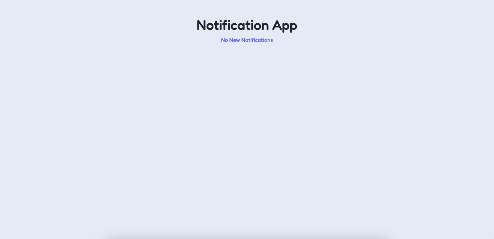
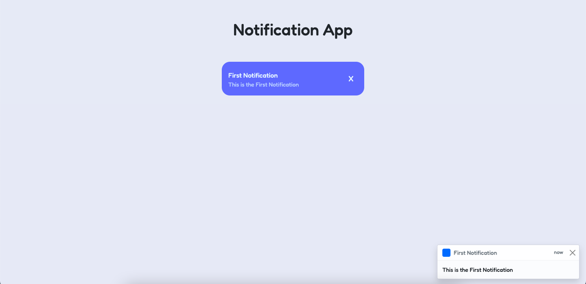
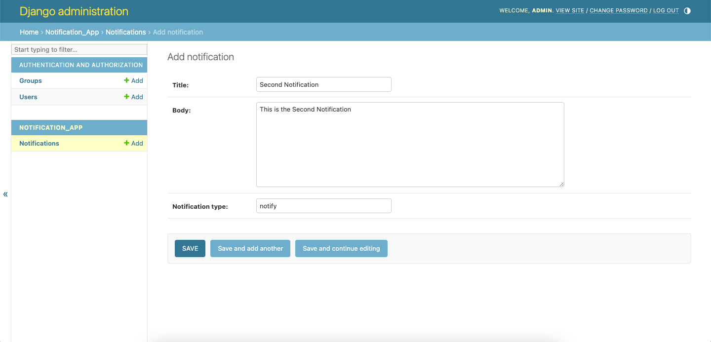
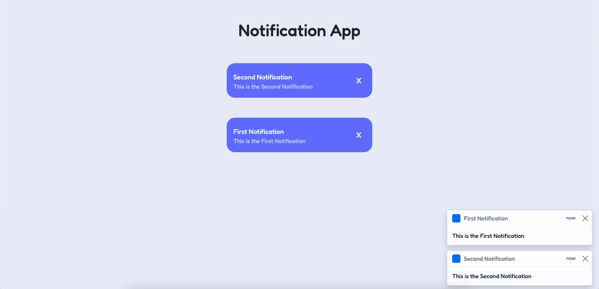

# SIMPLE NOTIFICATION APP USING DJANGO CHANNELS PACKAGE

## Description
This app is a simple demonstration of how to use django channels package to send notifications in real time. The notifications are sent to the browser using websockets.

## Installation
1. Clone the repository
2. Create a virtual environment and activate it
3. Install the requirements using `poetry install`
4. Run the migrations using `python manage.py migrate`

## Usage
1. Run the server using `python manage.py runserver`
2. Create a superuser using `python manage.py createsuperuser`
3. Start the Redis Server
4. Open the browser and go to `http://localhost:8000/`
5. Login to the admin panel and create a Notification
6. You will see the notification in the browser opened in step 4

## Screenshots

